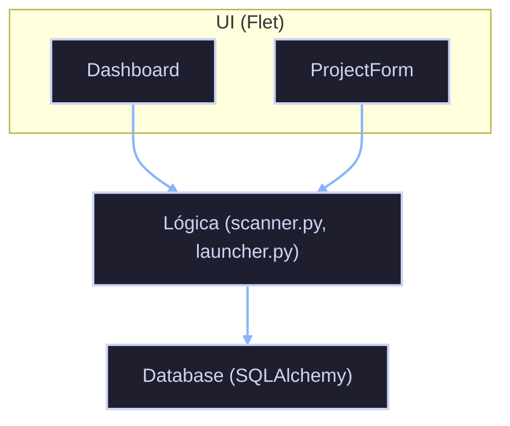

# Dev Project Hub

Gestor de repositorios y proyectos de desarrollo. Centraliza tus proyectos, rutas físicas, IDEs y credenciales en un único panel de control rápido y visual.

**Versión:** 1.0.0  
**Stack:** Python 3 · Flet 0.25 · SQLite · SQLAlchemy  
**Autor:** Hugo Medina S.  
**Año:** 2026

---

## Tabla de Contenidos

1. [Cómo ejecutar la aplicación](#cómo-ejecutar-la-aplicación)
2. [Arquitectura (explicación simple)](#arquitectura-explicación-simple)
3. [Estructura del proyecto](#estructura-del-proyecto)
4. [Cómo modificar colores](#cómo-modificar-colores)
5. [Cómo añadir nuevos lenguajes de programación](#cómo-añadir-nuevos-lenguajes-de-programación)
6. [Cómo cambiar rutas de archivos para diferentes SO](#cómo-cambiar-rutas-de-archivos-para-diferentes-so)
7. [Referencia de archivos clave](#referencia-de-archivos-clave)

---

## Cómo ejecutar la aplicación

### Requisitos

- Python 3.10+
- Dependencias: `flet`, `sqlalchemy`

```bash
pip install flet sqlalchemy
```

### Ejecutar

```bash
python main.py
```

La aplicación se abre en ventana (1200x800).

---

## Arquitectura (explicación simple)

Imagina que la aplicación es como una **oficina con tres secciones**:

1. **Recepción (UI/Dashboard)** — Es donde ves los proyectos. Cuando abres la app, puedes buscar proyectos, crear nuevos o editar existentes.

2. **Archivos (Base de datos SQLite)** — Es donde se guardan todos los datos. Cada proyecto es como una ficha en un archivador. Las credenciales son como notas adhesivas asociadas a cada ficha.

3. **Herramientas (Lógica de negocio)** — Son los empleados que hacen el trabajo:
   - **Scanner** escanea las carpetas para saber cuándo se modificaron por última vez.
   - **Launcher** abre los proyectos en el IDE correcto.

### Cómo se comunican los componentes



---

## Estructura del proyecto

```
GestorProyectos/
├── main.py              # Punto de entrada
├── projects.db          # Base de datos SQLite (se crea automáticamente)
│
├── db/
│   ├── models.py        # Definición de tablas (Proyecto, Credencial)
│   └── database.py       # Operaciones CRUD
│
├── logic/
│   ├── scanner.py       # Escaneo de archivos y fechas
│   └── launcher.py      # Apertura en IDEs
│
├─── ui/
    ├── dashboard.py     # Vista principal
    ├── components.py     # Tarjetas de proyectos
    ├── project_form.py  # Formulario de proyectos
    ├── credential_form.py # Formulario de credenciales
    ├── about_dialog.py  # Diálogo Acerca de
    └── __init__.py      # Exports públicos
    
```

---

## Cómo modificar colores

Los colores están definidos como constantes en cada módulo. Busca la sección `C_*` (Colors).

### Colores principales

| Constante | Valor | Uso |
|-----------|-------|-----|
| `COLOR_BG` | `#181825` | Fondo de la aplicación |
| `COLOR_APPBAR` | `#1E1E2E` | Barra superior |
| `COLOR_ACCENT` | `#2196F3` | Botones y acentos |
| `COLOR_TEXT` | `#CDD6F4` | Texto principal |
| `COLOR_MUTED` | `#6C7086` | Texto secundario |

### Dónde cambiar

- **Ventana principal:** `main.py:14-18`
- **Dashboard:** `ui/dashboard.py:16-23`
- **Formulario proyectos:** `ui/project_form.py:20-25`
- **Componentes:** `ui/components.py:15-25`
- **Formulario credenciales:** `ui/credential_form.py:23-29`

### Paleta de colores (Catppuccin Mocha)

| Color | Hex | Nombre |
|-------|-----|--------|
| Base | `#181825` | Background |
| Surface1 | `#1E1E2E` | Cards, dialogs |
| Surface2 | `#313244` | Inputs |
| Overlay | `#45475A` | Borders |
| Text | `#CDD6F4` | Primary text |
| Subtext | `#A6ADC8` | Secondary text |
| Muted | `#6C7086` | Disabled |
| Red | `#F38BA8` | Error |
| Peach | `#FAB387` | Warning |
| Yellow | `#F9E2AF` | Info |
| Green | `#A6E3A1` | Success |
| Blue | `#89B4FA` | Link |
| Mauve | `#CBA6F7` | Accent |
| Sky | `#74C7EC` | Info alt |
| Teal | `#94E2D5` | Success alt |

---

## Cómo añadir nuevos lenguajes de programación

### 1. Añadir al formulario (`ui/project_form.py`)

Busca `LENGUAJES` y añade el nuevo lenguaje:

```python
LENGUAJES = ["Python", "Nuxt", "Vue", "React", "CSharp", "Bat", "Shell", "TuNuevoLenguaje"]
```

### 2. Añadir icono en tarjetas (`ui/components.py`)

Busca `LANG_ICON` y añade el icono y color:

```python
LANG_ICON = {
    "TuNuevoLenguaje": (ft.Icons.CODE, "#HEXCOLOR"),
    # ... resto
}
```

### 3. Configurar IDEs disponibles (`logic/launcher.py`)

Busca `LANGUAGE_IDE_MAP` y configura qué botones de IDE aparecen:

```python
LANGUAGE_IDE_MAP = {
    "TuNuevoLenguaje": {"vscode": True, "pycharm": False, "vstudio": False},
    # ... resto
}
```

### 4. Añadir al modelo (`db/models.py`)

En la columna `lenguaje`, actualiza el comentario con los valores posibles:

```python
lenguaje = Column(
    String(50),
    nullable=False,
    default="Python"
    # Valores posibles: Python, Nuxt, Vue, React, CSharp, Bat, Shell, TuNuevoLenguaje
)
```

---

## Cómo cambiar rutas de archivos para diferentes SO

### Rutas de IDEs (`logic/launcher.py`)

Las rutas de IDEs están en constantes al inicio del archivo.

#### PyCharm (Windows)

```python
IDE_PYCHARM_WIN_PATHS = [
    r"C:\Program Files\JetBrains\PyCharm Community Edition\bin\pycharm64.exe",
    r"C:\Program Files\JetBrains\PyCharm Professional Edition\bin\pycharm64.exe",
]
```

#### PyCharm (macOS)

El comando es `charm` (buscado en PATH):

```python
IDE_PYCHARM_MAC = "charm"
```

#### Visual Studio (Windows)

```python
IDE_VSTUDIO_WIN_PATHS = [
    r"C:\Program Files\Microsoft Visual Studio\2022\Community\Common7\IDE\devenv.exe",
    # ... más rutas
]
```

### Cómo funciona la detección automática

El sistema detecta el SO con `platform.system()`:

```python
SYSTEM = platform.system()  # "Windows" | "Darwin" | "Linux"
```

Luego busca el IDE en:
1. Rutas conocidas (hardcoded)
2. `vswhere.exe` (para Visual Studio)
3. PATH del sistema (`shutil.which()`)

### Añadir soporte para Linux

1. Busca las rutas de los IDEs en Linux (típicamente `/usr/bin/` o `~/.local/bin/`)
2. Añádelas a las constantes correspondientes
3. El launcher usará `xdg-open` en lugar de `explorer` o `open`

---

## Referencia de archivos clave

### `main.py`

Punto de entrada. Define:
- Título de la ventana (`APP_TITLE`)
- Versión (`APP_VERSION`)
- Colores globales

### `db/models.py`

Define las tablas de la base de datos:
- `Proyecto`: Proyecto de desarrollo
- `Credencial`: Credenciales asociadas (1:N con Proyecto)

### `db/database.py`

Funciones CRUD:
- `get_all_projects()` / `search_projects(query)`
- `create_project(data)` / `update_project(id, data)` / `delete_project(id)`
- `get_credenciales(proyecto_id)`
- `create_credencial(proyecto_id, data)` / `update_credencial(id, data)` / `delete_credencial(id)`

### `logic/scanner.py`

Funciones de archivo:
- `get_last_modified(ruta)`: Fecha de última modificación
- `get_folder_size_mb(ruta)`: Tamaño total
- `path_exists(ruta)`: Verifica existencia
- `find_readme(ruta)`: Busca README.md

### `logic/launcher.py`

Funciones de IDE:
- `open_in_vscode(ruta)` / `open_in_pycharm(ruta)` / `open_in_vstudio(ruta)`
- `open_in_explorer(ruta)`

### `ui/dashboard.py`

Vista principal. Construye:
- Barra de búsqueda
- Lista de tarjetas
- Acciones de IDEs y URLs
- Integración con formularios

### `ui/project_form.py`

Formulario de proyectos:
- Alta y edición de proyectos
- Selector de carpetas (FilePicker)
- Validación de campos

### `ui/credential_form.py`

Formulario de credenciales:
- Gestión de múltiples credenciales por proyecto
- Mostrar/ocultar contraseña
- Inline editing

### `ui/components.py`

Componentes UI:
- `build_project_card()`: Tarjeta colapsable
- `build_empty_state()`: Estado sin proyectos
- `build_no_results_state()`: Estado sin resultados de búsqueda